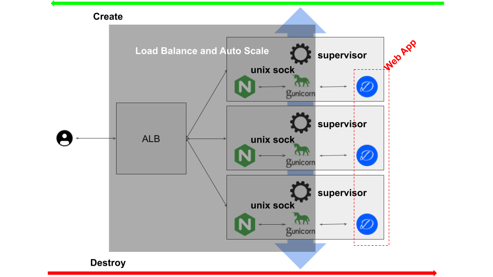

# Load Balancer base on AWS

This module is used for provisioning a WSGI-Compatible Python Web App environment composing of ALB, EC2 instances across multiple available zones, as illustrated by the following picture:



Each EC2 instance is configured with the following softwares:

1. Nginx
2. gunicorn
3. supervisor

then you need to develop your WSGI-Compatible Python Web App, and package it into `tar.gz` with the following folders structure:

```bash
.
  |-web-app-root
  |  |-web-app
  |  |  |-wsgiapp.py
  |  |-requirements.txt
```

That means, your WSGI-Compatible Python Web App package will contain a root folder *web-app-root*, which contains *web-app* folder, which contains a *wsgiapp.py* file, they can be renamed to fit your need, and you **have to** provide *requirements.txt* that contains python packages your web app need. After packaging your web app into *tar.gz*, you should storage it and make it accessible from Internet. Then, creating a file *main.tf* with the following content: 

```terraform
terraform {
  required_version = "= 0.12.19"
}

provider "aws" {
  version = "= 2.58"
  region = "ap-northeast-1"
}

module "load_balance" {
  source       = "github.com/2cloudlab/module_load_balancer//modules/load_balancer?ref=v0.0.1"
  download_url = <your-WSGI-Compatible-Python-Package-URL>
  package_base_dir         = <your-root-folder-name-in-web-app-package>
  app_dir = <your-web-app-folder>
  envs     = <your-app-environment-variables>
  wsgi_app = <WSGI-Entry>
}

output "alb_dns_name" {
  value       = module.load_balance.alb_dns_name
  description = "The domain name of the load balancer"
}
```

Pay more attention to the following variables:

1. `download_url`, this is a URL, pointing to your web app package, such as *https://github.com/digolds/digolds_sample/archive/v0.0.1.tar.gz*
2. `package_base_dir` is root folder in your web app package, such as *web-app-root*
3. `app_dir` is where your web app locates, such as *web-app*
4. `envs` is the envrionment variables your web app need, such as *["USER_NAME=slz", "PASSWORD=abc"]*
5. `wsgi_app` is WSGI callable object entry, if you define a callable object `my_wsgi_app` in *wsgiapp.py*, the value of `wsgi_app` should be `wsgiapp:my_wsgi_app`

When you konw how to specify these variables and feed them well, then you can run the following commands to provision the environment and up-and-running your WSGI-Compatible Python web app:

```bash
terraform init
terraform apply
```

It will output something like that:

```bash
Apply complete! Resources: 10 added, 0 changed, 0 destroyed.

Outputs:

alb_dns_name = alb-1-843275519.ap-northeast-1.elb.amazonaws.com
```

Wait about 5 minutes, because the preparation will involve updating the CentOS. After that, you can test your web app by executing the following command:

```bash
curl http://<alb_dns_name>
```

If you can see the web app's response, it means everything is up and running.

**Note**: you should replace *alb_dns_name* with your domain. As you can see from the testing, the ALB is listening on port 80 and right now do not support https. If you want to stop the web app, run the following command to destroy all the AWS resources:

```bash
terraform destroy
```